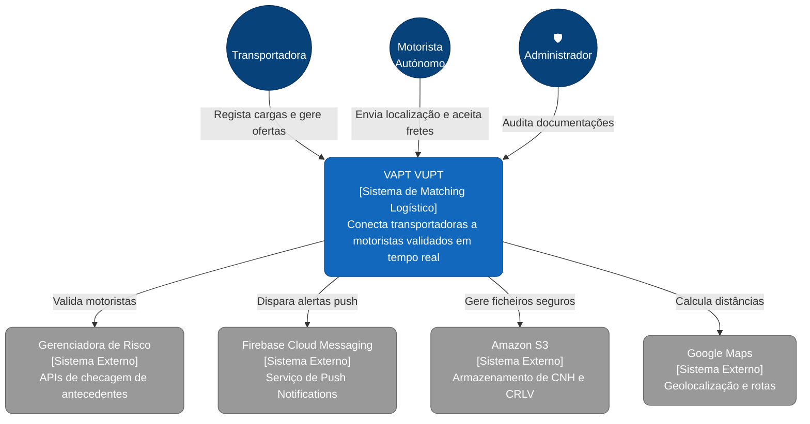
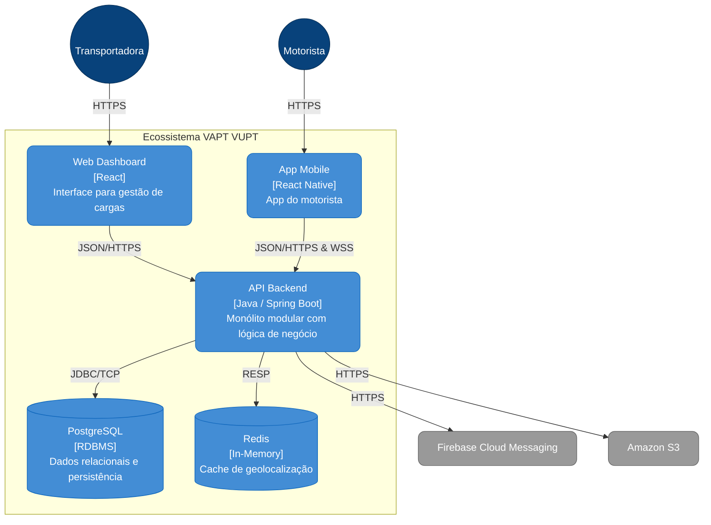
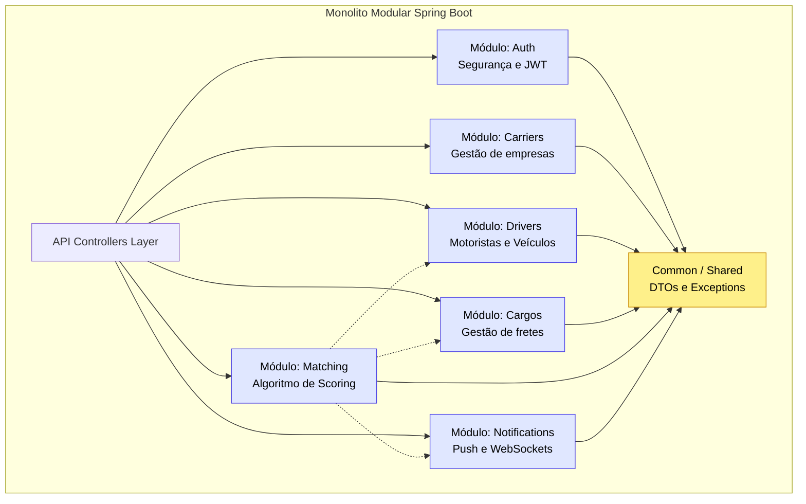
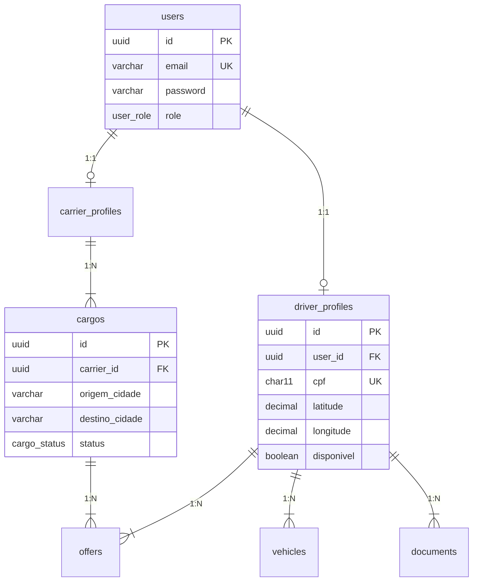

Aqui tens o documento Markdown (`.md`) completo e estruturado para a documentação técnica do projeto **VAPT VUPT**. Podes copiar este conteúdo e guardar num ficheiro chamado `ARCHITECTURE.md` dentro da pasta `/docs/architecture/` do teu repositório.

---

# Documentação de Arquitetura — VAPT VUPT

Esta documentação detalha a estrutura arquitetural do sistema **VAPT VUPT**, uma solução SaaS de logística para conexão entre transportadoras e motoristas autónomos. A arquitetura segue o modelo **C4 (Context, Container, Component, Code)** para facilitar a compreensão em diferentes níveis de abstração.

---

## 1. Visão Geral
O sistema funciona como uma camada de inteligência para o setor logístico, permitindo que transportadoras encontrem motoristas validados em tempo real, utilizando geolocalização e algoritmos de scoring.

---

## 2. Diagrama de Contexto (C4 Level 1)
Este nível descreve os atores que utilizam o sistema e as dependências com sistemas externos.

---

## 3. Diagrama de Contentores (C4 Level 2)
Detalhamento das tecnologias e como os principais blocos de software comunicam entre si.

---

## 4. Diagrama de Pacotes (Backend)
O backend é estruturado como um **Monólito Modular** para garantir a manutenibilidade e possível transição para microsserviços.

---

## 5. Protocolos e Comunicação

| Protocolo | Utilização | Finalidade |
| :--- | :--- | :--- |
| **REST (HTTPS)** | Geral | Operações síncronas de CRUD e autenticação. |
| **WebSocket (STOMP)** | Mobile -> Backend | Envio de coordenadas de geolocalização em tempo real. |
| **SSE** | Backend -> Web | Atualização automática do dashboard logístico. |
| **FCM Push** | Cloud -> Mobile | Notificação de cargas de alta prioridade. |

---

## 6. Modelo de Dados (ER)
Estrutura normalizada (3FN) para suporte à integridade dos dados.

---

## 7. Decisões de Arquitetura (ADR)
* **Java 21 & Spring Boot 3**: Utilização de Virtual Threads para melhor performance em I/O.
* **Flyway**: Controlo de versão do esquema da base de dados para ambientes de staging/prod.
* **PostGIS (Futuro)**: Planeada a extensão do PostgreSQL para cálculos geográficos complexos.
* **Imutabilidade**: Uso de `Records` em Java para DTOs.
